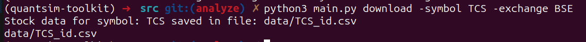

# QuantSim-Toolkit

**A Python-based quantitative simulation and analysis toolkit integrating probability simulations, stock return analysis, portfolio risk calculations, and Monte Carlo methods. Designed to demonstrate applied mathematics, numerical simulations, and CLI-based financial utilities.**

---

## Overview

QuantSim-Toolkit consolidates multiple quantitative and programming concepts into a single, **modular CLI project**. It bridges math, Python, 
and finance by allowing users to:

- Simulate probabilities and random events
- Analyze stock returns and risk
- Perform Monte Carlo simulations for stock price paths
- Interact with a unified CLI interface

This project focuses on **Quant Development**, emphasizing **code structure, applied math, and system-level thinking**

---

**Assumptions made**: 
1. **Linux Distribution** used - Ubuntu
2. **Dependency management** - uv (it needs to be installed in your local)
3. **Libraries used**: Numpy, Pandas, Matplotlib, Pytest, Bandit

**Prerequisites:**
1. Python version >= 3.12 should be installed in the system and added to your path
2. Git should also be installed 
3. Our dependency manager: **uv** which can be installed using the command **pip install uv** from the terminal in case of Linux. For other OS, please check the command online
and enter it from the terminal or command prompt. 

**How to install it on your local to try it out (follow the order of instructions):**
1. clone the repo using the command: **git clone https://github.com/rohit250799/QuantSim-Toolkit.git** from the terminal. It will be cloned in your current directory.
2. Now, to enter the root directory use the command: **cd root_dir_name** - replace the root_dir_name with the name of the actual root directory. To check the name, use: **ls** command
from the terminal and the name output is the name of your root directory. Next, all commands are to be entered from root directory. 
3. Now we need the perfect isolated environment to ensure the machine's own software versions do not pollute our own local environment for the project. So, enter the command
**uv sync** from the terminal and let uv build the perfect environment. 
4. Activate the virtual environment by using the command: **source .venv/bin/activate** (for linux users) if its not activated - if there is a (.venv) before every line, its activated successfully. 
5. To validate the systems / perform vanity checks - run the command **uv run pytest tests/ -v** from the terminal to perform the unit tests. The terminal will display your
test results on the screen. 
6. If all the unit tests passm you can try out actual logic etc. from the terminal by entering the command: **python3 -m src.main analyze -ticker 'TCS' -start '2025-09-01' -end '2025-09-21'**

**To start contributing on the project**, you have to first fork the repo and then repeat the previously mentioned steps on installing it into your local. 

---

Trying out the features(all commands should be entered in the terminal from the root directory):

Activate the virtual environment first by using **source .venv/bin/activate** from the root directory

1. To download data about a particular stock between a specific period: you can use the command **python3 -m src.main download -symbol 'NMDC' -sdate '2025-09-01' -edate '2025-09-23'**. Symbol refers to the name of the stock/ticker, sdate and edate are starting and ending dates respectively.  

In this case, there are some things that you need to know:

    a) Downloaded stock data will be in the CSV format
    b) To download the stock data, I have used Alpha Vantage API for this project, from where you can download data for free(to a certain limit). To get started with this, every user needs to have a API key from Alpha Vantage (which is free). You can visit this link and generate your own API key by [clicking here](https://www.alphavantage.co/support/#api-key)
    c) Once you get an API key, you have to store it in a .env file inside the modules/ directory. Store your API key there in the format: export API_KEY='A^5435NDD'
    d) In the above point, maintaining the format is very important in the .env file and there should be no space on either side of '='

The downloaded stock data will be **stored in the price_data table in db, and will be loaded as a Pandas DataFrame for easier analysis**. There will ne multiple validation checks performed on the downloaded
data like **checking for gaps**, **checking outliers** and **checking for stale data** and for those records that did not pass the validation checks, logs will be created in the logs directory.

2. Using generators with chunksize to read large downloaded CSV file data and calculating the daily stock returns on each chunk. You can use the analyzer by running the command **python3 -m src.main analyze -ticker 'TCS' -start '2025-09-01' -end '2025-09-21'** to calculate and display the key performance indicators. Replace the ticker 'TCS' with any other stock symbol you like which is traded in the appropriate market or change the start and end date, and the analysis results will keep changing accordingly.   

    Now, the key performance indicators of a particular stock are also displayed after the analysis. Using this feature, **the user can calculate his stock's performance against a benchmark**(NIFTY 50) by default.
    For now, the analysis command returns: **Daily Log returns, Cummulative returns, Annualized Volatility, Beta, Log Returns Alpha, Sharpe Ratio and Correlation Coefficient**. (as can be seen from the below image) 

    Note: 
    The Default Benchmark used in this project is NIFTY50 Index (Indian Market - NSE). If you want some other benchmark to be used, then you can specify the benchmark using the -benchmark and -bexchamge arguments.
    Be careful, that the benchmark used should match its appropriate exchange (for example - you can't use NIFTY50 as a benchmark with the exchange provided as NASDAQ).

    Problem with Alpha Vantage API:
    You cannot use the Alpha Vantage API to get the NIFTY50 data (since it's not shared by the market and there are no functions in the API to fetch it). As a workaround, I have downloaded the NIFTY50 data since the 
    last year to today in a CSV file and have used it for the Analysis (as a benchmark). So, there is no extra API used, but I have just expanded the Data Ingestion layer by just downloading and loading the Nifty50 data
    into a DataFrame using a simple Python script found here: scripts/seed_benchmark.py 

3. Now, the cumulative returns for the entire portfolio and for individual assets can be calculated for plotting it into line charts for easier understanding.
Simply navigate to the **portfolio_analyzer.py** file and run it in the terminal. Enter number 2 as input and then the chart will be displayed on the screen and will be saved in the plots directory as well. 

The chart will look like this:

4. To perform a validation check on your downloaded data and display the logs in your log file, you can use the command: **python3 -m src.main validate -tname 'TCS'**. Replace **TCS** with any other stock name you
have downloaded. The validation will be performed and the logs will be displayed on your logs file 

5. Now, it comes included with a **production grade error handling system. A Circuit breaker mechanism** is implemented which will **keep transitioning between states based on the API call results**. API call failures will **implement retry logic with exponential backoff and structured logging** - to help in easier debugging.

**API calls will only be allowed if the current state of the circuit breaker is Closed or Half-Open**. The failure count as a result of unsuccessful API calls will be tracked for transparent logging into the db. For this, 3 new tables have been created in the database for **Alerts, Error Metrics and API Call Metrics**.

**3 consecutive failures within a 5 minute window will now result in the State Transition of the Circuit Breaker from Closed to Open with a cooldown end time**. When the cooldown end time is over, state will be updated to **Half-Open** and there will be a single API call allowed, which if successful, will again revert back the State of the Circuit Breaker to **Closed**. If unsuccessful, the state will be updated to **Open** again. 

6. To run the unit tests using Pytest, enter the command **uv run pytest -v** from the root directory. 

The logs will be stored in **logs/errors.log**

7. To perform security tests on your code, you can use Bandit by running the command: **uv run bandit -c .bandit.yaml -r . -lll** and a security report will be generated on your terminal.

8. Enter the command: **python3 main.py simulation -tries 100** to test the probability of each side of the dice after 100 rolls. Replace 100 with any other integer number to change the number of rolls 

9. Enter command: **python3 main.py simulation -type coin -tries 100** to test the probability of each side of the coin after 100 tosses. Replace 100 with any other integer number to change the number of tosses 

10. To try simulation with multiple dice (< 10), you can use this command: **python3 main.py simulation -multi -dice 3 -sides 6 -tries 10**. You can change the number of dice, sides and tries

---

## Features (work in progress)

### 1. Probability Simulator
- Simulates dice rolls, coin tosses, and random events
- Estimates probabilities using Monte Carlo simulations
- Demonstrates applied probability concepts

### 1. Stock Return Analyzer - done
- Reads historical stock price CSVs
- Computes daily log returns, cummulative returns, annualized log returns alpha, beta etc
- Plots return distributions and moving averages for visualization

### 2. Portfolio Risk Calculator
- Computes portfolio variance using covariance matrices
- Estimates volatility and risk metrics
- Prepares for portfolio optimization tasks

### 3. Monte Carlo Stock Price Simulator
- Simulates stock price paths using Geometric Brownian Motion
- Calculates expected payoffs for hypothetical trading scenarios
- Demonstrates applied Monte Carlo simulations

### 4. CLI Interface - done
- Unified command-line interface using `argparse`
- Subcommands: `simulate`, `analyze`, `download`, `validate`
- Modular and easy-to-use workflow

---